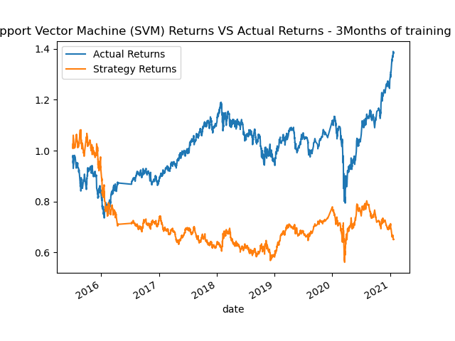
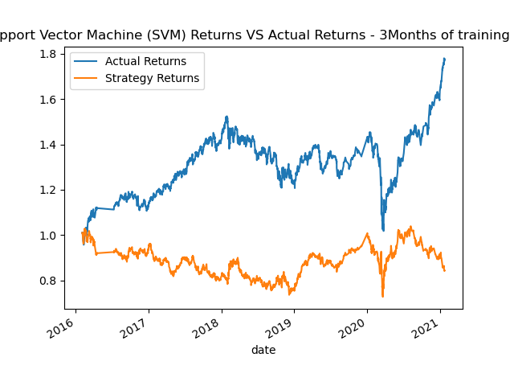

# **Machine Learning Trading Bot**

---
## Table of Contents
* [Introduction](#introduction)
* [Baseline Performance](#baseline-performance)
* [Tuning the Baseline Algorithm](#tuning-the-baseline-algorithm)
* [Evaluations of the Models](#evaluations-of-the-models)
* [Conclusion](#conclusion)
---

## ***Introduction:***

This report details the evaluation of a machine learning trading bot, aiming to improve existing algorithmic trading systems through data-driven decision making. We explored the performance of various configurations including parameter combinations and machine learning models.

---

## ***Baseline Performance:***

The initial model employed an SVC classifier based on short and long Simple Moving Average (SMA) features. The cumulative return comparison between actual and strategy returns serves as a benchmark for further assessments.

---

## ***Tuning the Baseline Algorithm:***

### 1. Training Window Size - 2 Methods created
All models are created with 2 senarios.

- 1st Models utilized 3 months of historical data for training and testing data. 

- 2nd Models utilized 6 months of historical data used for training and testing.
 
 ### 2. SMA Window Sizes: Fast/Slow. Ran 3 different SMA
   
- 4/100 Day Moving Average
- 50/100 Day Moving Average
- 20/50 Day Moving Average

Varying the short and long SMA windows produced diverse results. The combination of 50-day low and 100-day high SMA resulted in the most significant positive impact on strategy returns compared to the baseline.
Key Takeaway: Experimenting with SMA windows yielded mixed results, emphasizing the importance of finding the optimal combination for specific datasets.

#### 3. New Machine Learning Classifiers:
   - Support Vector Machine: Base model used
   - LogisticRegression: underperformed both the baseline and tuned models.
   - DecisionTreeClassifier achieved results comparable to the baseline.

---

## ***Evaluations of the Models:***

---

## 1. Support Vector Machine:

    - Classification Reports for 4/100 SMA:

    - Classification Reports for 50/100 SMA:

 

    - Classification Reports for 20/50 SMA:

 

---

## 2. LogisticRegression:

    - Classification Reports for 4/100 SMA:

    - Classification Reports for 50/100 SMA:

  

    - Classification Reports for 20/50 SMA:

 

---

## 3. DecisionTreeClassifier:

    - Classification Reports for 4/100 SMA:

    - Classification Reports for 50/100 SMA: 
    

    - Classification Reports for 50/50 SMA:

## ***Conclusion:***

Question: What impact resulted from increasing or decreasing the training window?

Answer: I made two SVM models... One with a training window with 3 months(SVM1) and one with 6 months (SVM2). The second model was slightly better after reviewing the classification report under precision and accuracy. However, not enough to be called successful. I will do the same with all the models to see what comes out better.

Question: What impact resulted from increasing or decreasing either or both of the SMA windows?

Answer: The shorter the duration of simple moving average's the less accurate it seemed to be when compared to the longer duration. In other words the sma with a 50 day and 100 day moving average performed better than both the other SMA I used.

The tuned model utilizing a 50-day low/100-day high SMA strategy and a 3-month training window demonstrated the most promising performance amongst all configurations. Additionally, the SVC classifier remained the most effective model for this specific dataset.

Disclaimer: This report is for informational purposes only and should not be considered financial advice. Always conduct your own research and due diligence before making any investment decisions.

**Link to code** [Module 14 challenge](machince_learning_trading_bot.ipynb)
